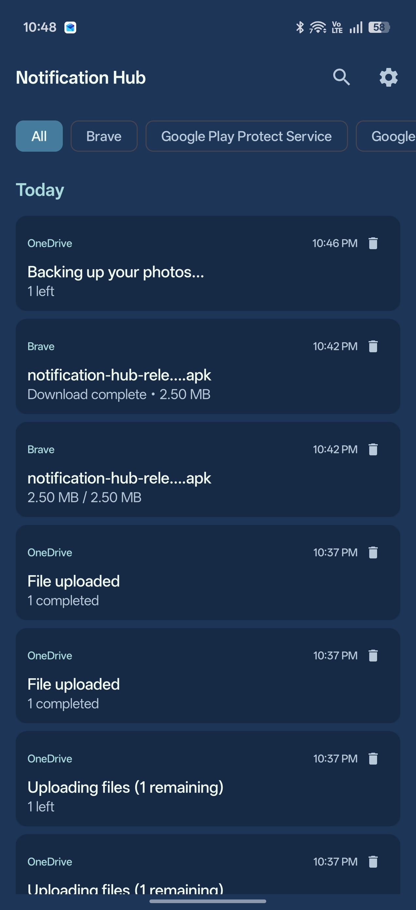
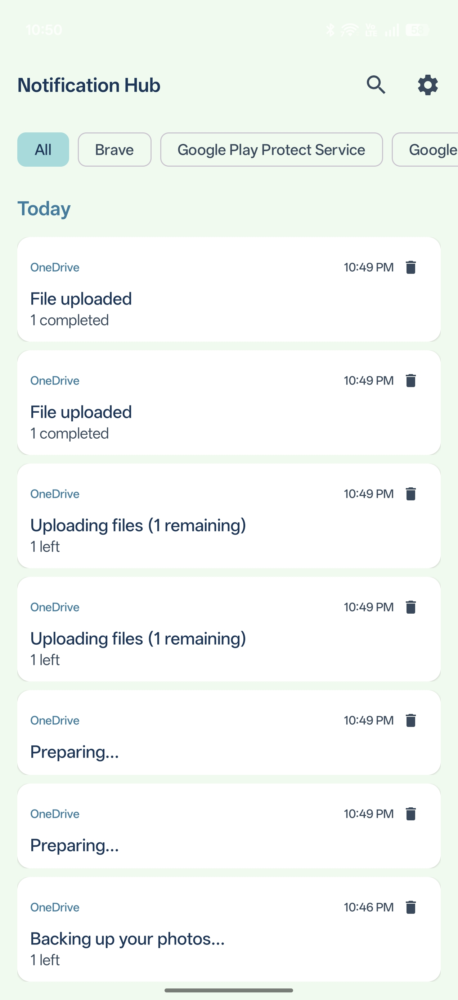

# Notification Hub

An Android app that captures and preserves all your phone notifications, even after you dismiss them. Built for sideloading on OnePlus 15 (OxygenOS 16.0.2).

## Download

[**Download Notification Hub v1.0.2 (Release APK)**](https://raw.githubusercontent.com/BoardPandas/notification-hub/main/releases/notification-hub-release.apk)

Install via ADB:
```bash
adb install notification-hub-release.apk
```

## Screenshots

<p align="center">
  
  &nbsp;&nbsp;
  
</p>

## What It Does

- Captures every notification your phone receives in real-time
- Stores notifications locally for 7 days
- Organizes notifications by day (Today, Yesterday, older dates)
- Persists dismissed notifications so you can always go back and check
- Supports light and dark mode with a custom color theme
- Auto-cleans notifications older than 7 days

## Tech Stack

- **Language**: Kotlin
- **UI**: Jetpack Compose + Material Design 3
- **Database**: Room (SQLite)
- **Architecture**: ViewModel + Flow
- **Min SDK**: 29 (Android 10)
- **Target SDK**: 35 (Android 15)

## How It Works

The app uses Android's `NotificationListenerService` to capture all notifications as they arrive. Each notification is saved to a local Room database with the app name, title, text, and timestamp. The UI reads from the database using Kotlin Flows, so the list updates in real-time. A cleanup task removes entries older than 7 days.

## Setup

### Prerequisites

- Android Studio (latest stable)
- JDK 17+
- Android SDK 35

### Build & Install

```bash
# Clone the repo
git clone <repo-url>
cd notification-hub

# Open in Android Studio and sync Gradle
# Or build from command line:
./gradlew assembleDebug

# Install on connected device
adb install app/build/outputs/apk/debug/app-debug.apk
```

### First Launch

1. Open Notification Hub on your phone
2. Tap "Open Settings" to grant notification access
3. Find "Notification Hub" in the list and enable it
4. Return to the app - notifications will start appearing as they arrive

## Project Structure

```
app/src/main/java/com/notificationhub/
├── NotificationHubApp.kt          # Application class (database init)
├── MainActivity.kt                # Entry point, permission check
├── data/
│   ├── NotificationEntity.kt      # Room entity (DB schema)
│   ├── NotificationDao.kt         # Database queries
│   └── NotificationDatabase.kt    # Room database singleton
├── service/
│   └── NotificationCaptureService.kt  # NotificationListenerService
├── ui/
│   ├── theme/
│   │   ├── Color.kt               # Brand color palette
│   │   ├── Theme.kt               # Light/dark theme config
│   │   └── Type.kt                # Typography
│   ├── screens/
│   │   └── NotificationListScreen.kt  # Main screen
│   └── components/
│       └── NotificationCard.kt    # Individual notification card
└── viewmodel/
    └── NotificationViewModel.kt   # Data layer for UI
```

## Color Palette

| Color | Hex | Usage |
|-------|-----|-------|
| Punch Red | `#E63946` | Accents, errors, tertiary |
| Honeydew | `#F1FAEE` | Light background |
| Frosted Blue | `#A8DADC` | Secondary, dark primary |
| Cerulean | `#457B9D` | Light primary |
| Oxford Navy | `#1D3557` | Dark background, light text |

## Key Commands

```bash
# Build debug APK
./gradlew assembleDebug

# Build release APK
./gradlew assembleRelease

# Run unit tests
./gradlew test

# Run instrumented tests
./gradlew connectedAndroidTest

# Lint check
./gradlew lint
```

## License

MIT
